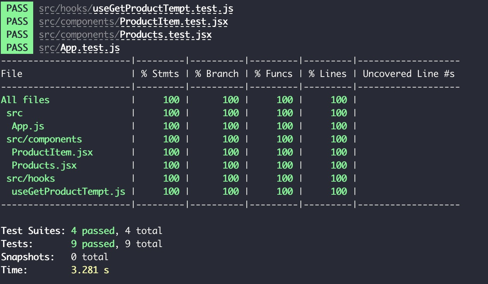
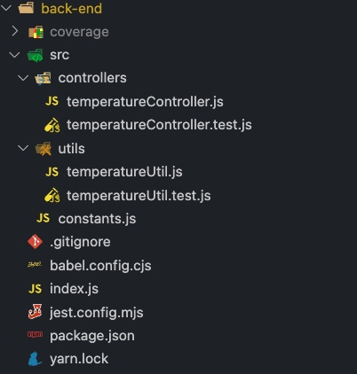

# Coding Test Submissions

### How to run

- **Front-end**

```bash
> cd front-end
> yarn
> yarn start
```

- **Back-end**

```bash
> cd back-end
> yarn
> yarn start
```

## _1. Highlights of your improvements_

- **Front-end**

  - Refactor source code structures, split `App.js` into smaller components and hooks

    

  - Test coverage

    

- **Back-end**

  - Refactor source code structures, create `controllers` folder and `utils`

    

  - Test coverage

    

- Move logic of validate product temperature status to Back-end to simplify Front-end works for only viewing

## _2. What would you improve next if you had more time?_

- **Front-end**

  - Convert the part of fetching Product by product Id into separated hook which only handle Product Polling
  - Add hook to handle httpClient request to handle response and error as a generic hook
  - Improve test with Snapshot testing
  - Use ReactQuery to handle Interval queries and retries in case of failure request

- **Back-end**
  - Convert part of fetch 3rd party temperature service into service component to simplify controller logic for purpose of receiving request and response data
  - Re-structure controller folder to have it own route such as `/temperature`
  - Create `routes.js` to manage all routes
  - Adding request schema validation to validate Input Request
  - Add retries when falure fetching 3rd party such as rate limiting or unavaialble service

## _3. Questions you would ask and your own answers and assumptions?_

- I assume `https://temperature-sensor-service.herokuapp.com` service will be available and no rate limiting.

## _4. Explanations of decisions or the approach you took_

- **Front-end**
  - From original `App.js` component, I realise it can be split into smaller component such as `table`, `row` item for easier on testing and improve coding coverage. Create smaller components are also easier on managing and reviewing code and reusable in other components. Therefore I decided to split into smaller components as `Products.js` for wrapping `table` and `ProductItem.js` for wrapping `row` item
  
  - I also split code of fetching Back-end api into a hook. Using hook to wrap component logic also make easier on test, we can test those logic independently from component and gain more confident on testing. It also remove duplication usage and easy to share across components.

  - I also move the logic for validate temperature to Back-end, because I always try to reduce as much as possible to make Front-end code to due with viewing purpose only. The more logic we add to Front-end part, the more heavy and bad UX can produce in user browser

- **Back-end**

  - With original `index.js` which gather all in one file, it is extremely hard to write tests. Therefore I decided to split it into more structure source code with controllers and utils
  - I still want to restructure more detail to make Back-end more readable and manageble when more complex code come